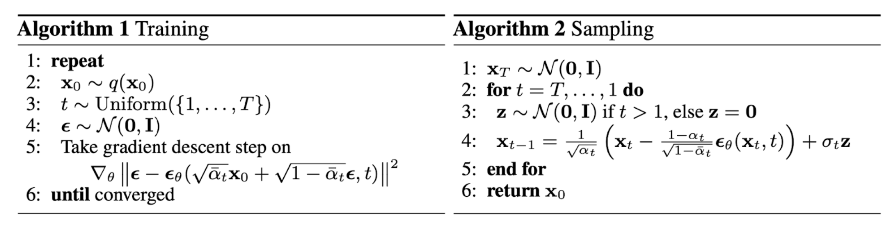

#### DDPM
__1. 前向过程__
$$
x_t = \sqrt{1 - \beta_t}x_{t-1} + \sqrt{\beta_t}\epsilon_{t-1}
\\
where :  \epsilon_t \sim N(0, 1)
$$ 
其中$\beta_t$是前向过程每一步添加的噪声, 起始的$\beta$比较小, 随着加噪过程逐渐增大. 
于是: 
$$
x_t \sim N(\sqrt{1-\beta_t}x_{t-1},\sqrt{\beta_t}\mathbf{I}) \\ 
q(x_{t}|x_{t-1}) = \mathbin{N}(x_t, \sqrt{1-\beta_t}x_{t-1},\sqrt{\beta_t}\mathbf{I})
$$ 
因此, 每个$x_t$只与$x_{t-1}$有关, 这是一个马尔科夫过程
于是, 可得
$$
x_t = \sqrt{\bar{\alpha_t}}x_0 + \sqrt{1-\bar{\alpha}_t}\epsilon
$$
即给定加噪的步数和初值, 就能求出任意时刻的分布$x_t$
__2. 反向过程__
根据贝叶斯公式
$$
    q(x_t|x_{t-1}, x_0) = \frac{q(x_t|x_{t-1} ,x_0)q(x_{t-1}|x_0)}{q(x_t|x_0)}
$$
把上述公式用概率密度展开: 
$$
    \begin{cases}
        \frac{1}{\sigma^2} = \frac{\alpha_t}{\beta_t} + \frac{1}{1 - \bar\alpha_{t-1}}
        \\
        \frac{2\mu}{\sigma^2} = \frac{2\sqrt{\alpha_t}}{\beta_{t}}x_t + \frac{2\sqrt{\bar{\alpha_{t-1}}}}{1-\bar\alpha_t}x_0
    \end{cases}
$$
于是, 可以求解出均值$\mu$.
下面是Diffusion的训练过程. 

参考论文和网络博客实现了DDPM demo, 用来加深对diffusion的理解. 使用diffusers.unet补全了unet模块. 