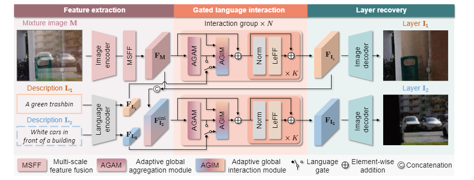
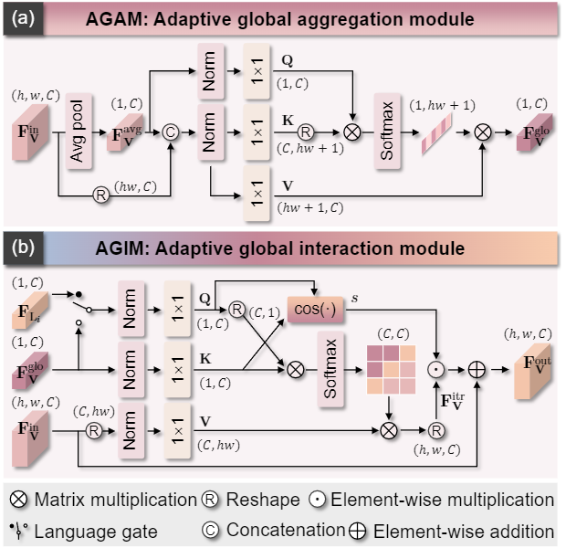

### Language-guided Image Reflection Separation
[Paper](https://arxiv.org/abs/2402.11874)
* __Method__

  * Not a diffusion model. Just to compare.
  * 网络输入: 带有反射的图片M,  语义描述$L_1,  L_2$
  * 输出: 反射层R和透射层T.
* __Feature Extraction__
  * Image Encoder
    * ResNet-50 把输入$M_{H*W*3}$转换成${F_{M_{i}}}_{i = 1}^5$
  * Multi-scale feature fusion
    * refine the hypercolumn feature by a 1 × 1 convolutional layer with a GELU activation 
    * Then LeFF. 
    * output a $F_M \in \mathbb{R}^{h*w*C}$
  * Language Encode
    * CLIP
* __Gated language interaction__
  * AGAM : ather global information of input visual features
  * language gate : prevent detrimental guidance.
  * AGIM : conduct interactions using global feature.
