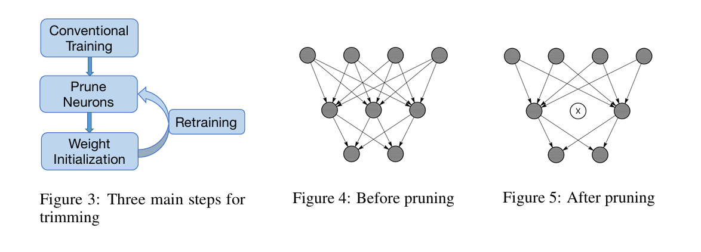

### Network Trim Method
论文: [Network Trimming: A Data-Driven Neuron Pruning Approach towards Efficient Deep Architectures](https://arxiv.org/pdf/1607.03250)

作者在对现在主流的CNN网络进行分析后，发现CNN中的很多神经元的“表现力”很弱(low activations)，这些神经元可以被剪枝，同时网络的表现能力不会被破坏，作者提出了一个可迭代的优化方法来对这些弱神经元进行剪枝. 

参数 __APoZ__: Average Percentage of Zeros.
$$
\operatorname{APo} Z_{c}^{(i)}=\operatorname{APoZ}\left(O_{c}^{(i)}\right)=\frac{\sum_{k}^{N} \sum_{j}^{M} f\left(O_{c, j}^{(i)}(k)=0\right)}{N \times M}
$$
在VGG-16上描述了这种方法: 在ImageNet数据集上训练, 并计算了每一层的APoZ值. 根据APoZ值进行剪枝. 

由于一次剪枝太多神经元会降低神经网络的表达能力, 采用迭代的方法.  