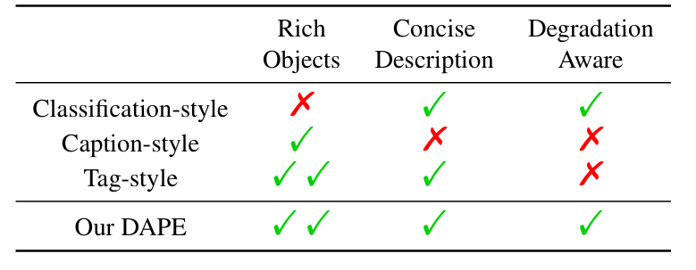
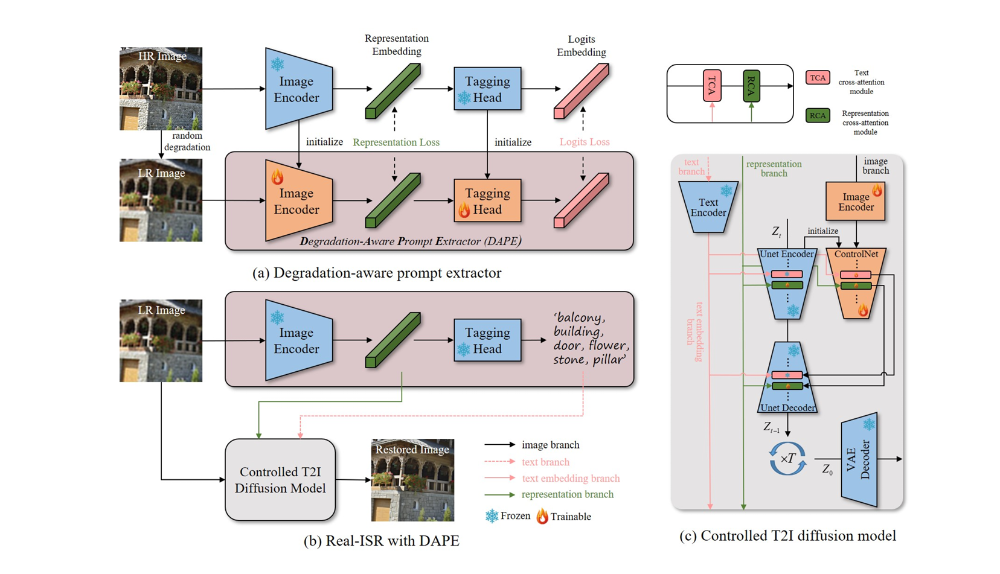

### SeeSR
[SeeSR: Towards Semantics-Aware Real-World Image Super-Resolution](https://arxiv.org/pdf/2311.16518)

* __Motivation__
  * __classfication-style__ prompt的结果和不用提示词几乎没有区别
  * __caption-style__ prompt: 
    * 冗余副词和介词, 注意力退化
    * 由于LR图像退化, 出现语义错误. 
  * __tag-style__ prompt:
    * Not degration-aware. 
    * need prompt to be accurate, rather cause distortion.

#### Modules
* __Degradation-Aware Prompt Extractor__
  * Fine-tuned from tag-prompt extractor.
    * 使用HR图片通过RAM的提示词监督训练DAPE. 目标函数是: 
$$
\mathcal{L}_{D A P E}=\mathcal{L}_{r}\left(f_{y}^{r e p}, f_{x}^{r e p}\right)+\lambda \mathcal{L}_{l}\left(f_{y}^{\text {logits }}, f_{x}^{\text {logits }}\right)
$$ $\mathcal{L}_{r}$是MSE, $\mathcal{L}_{l}$是cross-entropy loss.
* 另一侧是ControlNet

于是, 需要训练的部分是: 
__the image encoder, the ControlNet and the RCA modules within the Unet.__

*  __LR Embedding in Inference__
   * Directly embed the LR latent into the initial random Gaussian noise according to the training noise scheduler. 
   * 有效去除生成SR图片的伪影. 

* __Drawbacks__
  * DAPE
 may predict incorrect tags for heavily degraded images, resulting in wrongly restored objects. Second, the alignment between tags and regions in the LR image can be inaccurate in cases of severe degradation. Providing extra mask information can help alleviate this issue. Third, as in other SD-based methods, SeeSR encounters challenges in reconstructing small-scale scene text images 